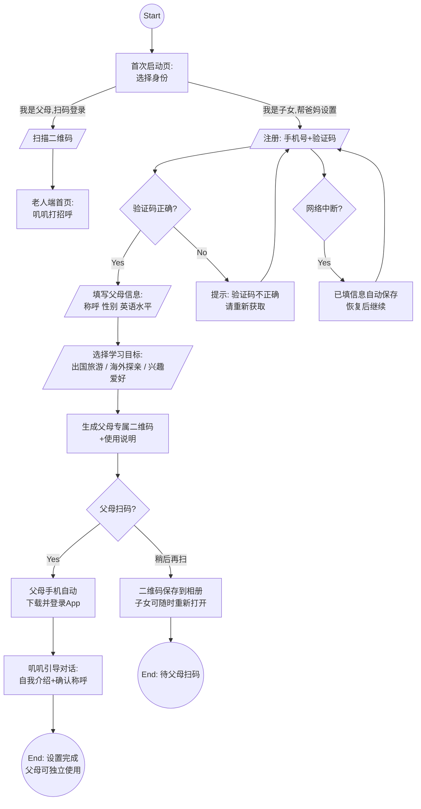
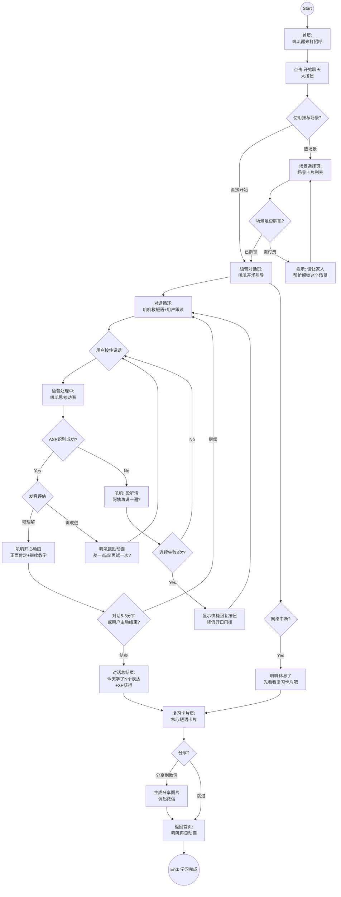
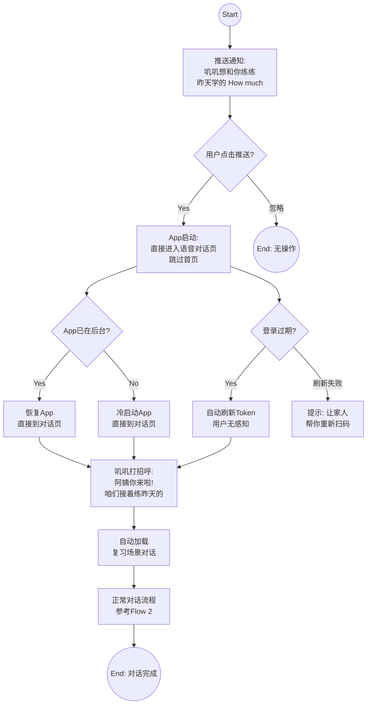
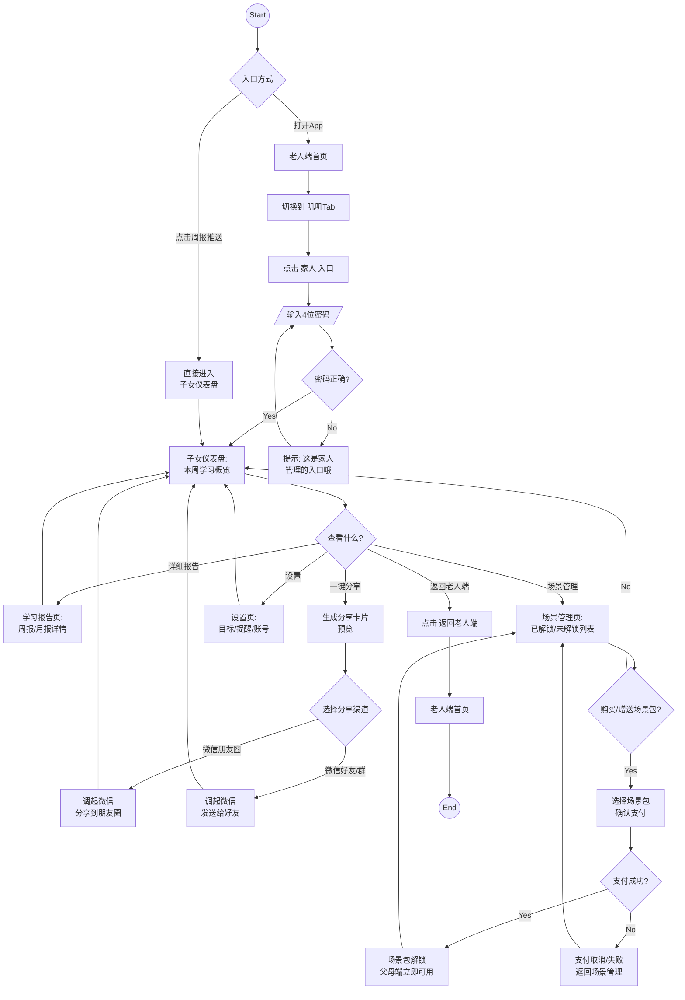
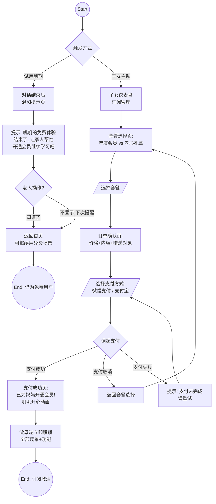
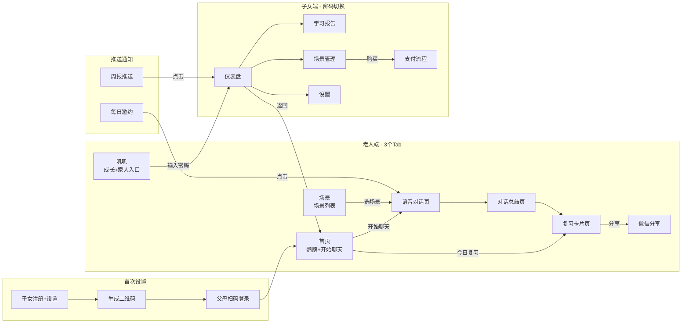

# User Flows: 叽里咕噜 MVP

**Feature Branch**: `001-jiligulu-mvp`
**Created**: 2026-03-06
**Source**: [spec.md](./spec.md), [INFO_ARCHITECTURE.md](./INFO_ARCHITECTURE.md)

## Overview

本文档包含叽里咕噜MVP的5条核心用户流程。所有老人端流程严格遵循适老化原则：核心任务 ≤ 5步完成，无登录页面，异常路径以鹦鹉拟人化语言呈现而非技术错误。

---

## Flow 1: 子女首次设置流

**Actor**: 子女（25-40岁）
**Trigger**: 子女下载并首次打开App
**Goal**: 3分钟内为父母创建账号，生成扫码登录二维码

### Flow Details

| Step | Screen | User Action | System Response | Next Step |
|------|--------|-------------|-----------------|-----------|
| 1 | 首次启动页 | 选择"我是子女,帮爸妈设置" | 进入注册页 | 注册页 |
| 2 | 注册页 | 输入手机号,点获取验证码 | 发送短信验证码 | 验证输入 |
| 3 | 注册页 | 输入验证码 | 验证通过,进入信息填写 | 父母信息页 |
| 4 | 父母信息页 | 填称呼/性别/英语水平 | 保存信息 | 目标选择页 |
| 5 | 目标选择页 | 选择学习目标(单选大按钮) | 生成配置,创建父母账号 | 二维码页 |
| 6 | 二维码页 | 展示二维码给父母扫描 | 等待扫码确认 | 父母端首页 |
| 7 | 父母端首页 | 父母扫码后自动登录 | 叽叽醒来打招呼,引导首次对话 | 对话页 |

### Decision Points

| Decision | Condition | Path A | Path B |
|----------|-----------|--------|--------|
| 身份选择 | 用户是子女还是父母 | 子女: 进入设置向导 | 父母: 直接扫码登录 |
| 父母是否立即扫码 | 父母在身边 | 立即扫码完成设置 | 二维码保存,稍后扫码 |

### Error Paths

| Error Condition | Handling | Recovery |
|-----------------|----------|----------|
| 验证码错误 | 提示"验证码不正确" | 重新获取验证码 |
| 网络中断 | 已填信息自动本地保存 | 恢复网络后从断点继续 |
| 二维码过期 | 提示过期,提供"重新生成"按钮 | 点击重新生成 |

---

## Flow 2: 老人日常学习流

**Actor**: 老人（55-70岁退休人群）
**Trigger**: 老人打开App（或点击推送）
**Goal**: 完成一次5-8分钟语音对话，学会3-5个英语短语

### Flow Details

| Step | Screen | User Action | System Response | Next Step |
|------|--------|-------------|-----------------|-----------|
| 1 | 首页 | 打开App | 叽叽醒来动画+打招呼 | 首页 |
| 2 | 首页 | 点击"开始聊天" | 加载推荐场景或跳转场景选择 | 对话页/场景页 |
| 3 | 语音对话页 | 听叽叽开场白 | 叽叽用中文描述场景+引出第一个英语表达 | 对话页 |
| 4 | 语音对话页 | 按住说话按钮跟读 | ASR识别+发音评估+叽叽反馈 | 对话页 |
| 5 | 语音对话页 | 持续对话5-8分钟 | 教3-5个新表达,自然复现旧词汇 | 对话总结页 |
| 6 | 对话总结页 | 查看学习成果 | 展示新学表达+XP+叽叽成长 | 复习卡片页 |
| 7 | 复习卡片页 | 翻看卡片/听发音 | 显示英文+中文+音标+谐音 | 首页 |

### Decision Points

| Decision | Condition | Path A | Path B |
|----------|-----------|--------|--------|
| 场景选择 | 用户是否想自选场景 | 直接用推荐场景开始 | 进入场景列表选择 |
| 对话结束 | 对话时长或用户意愿 | 5-8分钟后叽叽引导结束 | 用户随时可点返回结束 |
| 分享 | 用户是否想分享成果 | 生成卡片分享到微信 | 跳过直接返回首页 |

### Error Paths

| Error Condition | Handling | Recovery |
|-----------------|----------|----------|
| ASR识别失败 | 叽叽播放"没听清,再说一遍?" | 用户重试,3次后显示快捷回复 |
| LLM超时(>5秒) | 叽叽思考动画+"嗯...让叽叽想想" | 自动重试,切换备用LLM |
| TTS失败 | 显示文字回复(大字幕) | 文字正常显示,语音缺失 |
| 网络中断 | "叽叽休息了,先看复习卡片吧" | 引导到离线复习卡片 |
| 全链路失败 | "叽叽累了需要休息一下" | 保存进度,建议稍后再试 |

---

## Flow 3: 推送唤醒流

**Actor**: 老人（收到每日推送的用户）
**Trigger**: 老人点击推送通知
**Goal**: 从推送直接进入对话，最少步骤开始学习

### Flow Details

| Step | Screen | User Action | System Response | Next Step |
|------|--------|-------------|-----------------|-----------|
| 1 | 系统通知栏 | 点击推送通知 | 启动App,跳过首页 | 语音对话页 |
| 2 | 语音对话页 | 无需操作 | 叽叽自动打招呼+加载复习场景 | 语音对话页 |
| 3 | 语音对话页 | 正常对话 | 同Flow 2对话循环 | 对话总结页 |

### Error Paths

| Error Condition | Handling | Recovery |
|-----------------|----------|----------|
| Token过期 | 自动静默刷新,用户无感知 | 刷新失败则提示重新扫码 |
| 推送场景数据丢失 | 回退到首页+推荐场景 | 用户从首页正常开始 |

---

## Flow 4: 子女查看进展流

**Actor**: 子女（25-40岁）
**Trigger**: 子女打开App想查看父母学习进展（或收到周报推送）
**Goal**: 查看父母学习数据，一键分享成果到微信

### Flow Details

| Step | Screen | User Action | System Response | Next Step |
|------|--------|-------------|-----------------|-----------|
| 1 | 老人端/叽叽Tab | 点击"家人"入口 | 弹出密码输入框 | 密码验证 |
| 2 | 密码输入 | 输入4位数字密码 | 验证密码 | 仪表盘 |
| 3 | 子女仪表盘 | 查看学习概览 | 展示本周数据+叽叽成长 | 仪表盘 |
| 4 | 子女仪表盘 | 点击"一键分享" | 生成分享卡片预览 | 分享选择 |
| 5 | 分享选择 | 选微信朋友圈/好友 | 调起微信分享 | 仪表盘 |

### Decision Points

| Decision | Condition | Path A | Path B |
|----------|-----------|--------|--------|
| 入口方式 | 从App进入还是推送 | App: 需切Tab+输密码 | 推送: 直接进仪表盘 |
| 操作选择 | 子女想做什么 | 查看报告/分享/管理场景/设置 | 返回老人端 |
| 场景购买 | 是否购买场景包 | 进入支付流程 | 返回仪表盘 |

### Error Paths

| Error Condition | Handling | Recovery |
|-----------------|----------|----------|
| 密码输入错误 | 友好提示"这是家人管理入口" | 可重新输入,无锁定 |
| 支付失败 | 提示支付未完成 | 返回场景管理页重试 |
| 分享卡片生成失败 | 提示"卡片生成中,请稍后" | 自动重试 |

---

## Flow 5: 付费购买流

**Actor**: 子女（付费决策者,从子女仪表盘操作）或老人端弹出引导
**Trigger**: 7天免费试用到期 / 子女主动购买
**Goal**: 完成年度会员订阅

### Flow Details

| Step | Screen | User Action | System Response | Next Step |
|------|--------|-------------|-----------------|-----------|
| 1a | 对话结束(老人端) | 试用到期自动弹出 | 温和提示让家人帮忙开通 | 老人端首页 |
| 1b | 子女仪表盘 | 点击"订阅管理" | 展示套餐选择 | 套餐选择页 |
| 2 | 套餐选择页 | 选择年度会员/孝心礼盒 | 展示价格和内容对比 | 订单确认页 |
| 3 | 订单确认页 | 确认订单 | 展示支付方式 | 支付方式选择 |
| 4 | 支付 | 选微信/支付宝 | 调起三方支付 | 支付结果 |
| 5 | 支付成功页 | 查看成功信息 | 叽叽开心动画+父母端解锁 | 仪表盘 |

### Decision Points

| Decision | Condition | Path A | Path B |
|----------|-----------|--------|--------|
| 触发方式 | 试用到期还是主动购买 | 老人端温和提示(不强制) | 子女端直接进入套餐选择 |
| 套餐选择 | 年度会员vs孝心礼盒 | 198/年: 全功能 | 298/年: 全功能+定制祝福+礼品卡 |
| 支付结果 | 支付是否成功 | 成功: 立即激活 | 失败/取消: 可重试 |

### Error Paths

| Error Condition | Handling | Recovery |
|-----------------|----------|----------|
| 支付超时 | 提示"支付未完成" | 可重新发起支付 |
| 网络中断 | 提示"网络不稳定,请稍后" | 订单保留,恢复后可继续 |
| 老人端弹付费提示 | 绝不阻断使用,温和引导 | "知道了"关闭,免费场景仍可用 |

---

## Navigation Overview

---

## Cross-Flow Dependencies

| Flow | Prerequisites | Enables | Shared Screens |
|------|--------------|---------|----------------|
| Flow 1: 子女设置 | None (入口流) | Flow 2-5 所有后续流程 | 首页 |
| Flow 2: 日常学习 | Flow 1 完成 | Flow 4 有数据可看 | 首页, 对话页, 复习卡片 |
| Flow 3: 推送唤醒 | Flow 1 完成 + 推送权限 | 同 Flow 2 | 对话页 |
| Flow 4: 子女查看 | Flow 1 完成 + 有学习数据 | Flow 5 付费转化 | 仪表盘 |
| Flow 5: 付费购买 | Flow 1 完成 + 试用期结束 | 解锁付费场景 | 仪表盘, 套餐页 |

---

## Screens Identified (Total: 14)

### Elder Screens (8)

| # | Screen | Purpose |
|---|--------|---------|
| 1 | 首页 | 鹦鹉动画 + 开始聊天入口 |
| 2 | 场景选择页 | 场景包 + 场景卡片列表 |
| 3 | 语音对话页 | 鹦鹉动画 + 字幕 + 按住说话 |
| 4 | 对话总结页 | 学习成果 + XP + 叽叽成长 |
| 5 | 复习卡片页 | 可翻页短语卡片 + 听发音 |
| 6 | 叽叽状态页 | 成长阶段 + 里程碑 + 家人入口 |
| 7 | 付费提示(叠加层) | 温和引导让家人帮忙开通 |
| 8 | 离线提示(叠加层) | 叽叽休息了,引导看复习卡片 |

### Child Screens (6)

| # | Screen | Purpose |
|---|--------|---------|
| 9 | 首次启动/身份选择 | 子女 vs 父母入口 |
| 10 | 子女设置向导 | 注册 + 填信息 + 选目标 + 生成二维码 |
| 11 | 子女仪表盘 | 学习概览 + 分享 + 场景管理 + 设置 |
| 12 | 学习报告详情 | 周报/月报详细数据 |
| 13 | 套餐选择/支付 | 年度会员 vs 孝心礼盒 |
| 14 | 分享卡片预览 | 生成的卡片预览 + 分享渠道选择 |

---

## Flow Diagram Legend

| Symbol | Meaning |
|--------|---------|
| `((Circle))` | Start/End point |
| `[Rectangle]` | Screen or page |
| `{Diamond}` | Decision point |
| `[/Parallelogram/]` | User input |
| `-->` | Navigation/transition |
| `-->\|Label\|` | Conditional transition |
| `-.->` | Optional/async flow |

---

## Eldercare Flow Design Notes

- **老人端所有核心流程 ≤ 5步**: 打开App(1) → 点开始聊天(2) → 对话(3) → 看总结(4) → 看卡片(5)
- **老人端无登录页面**: 子女帮设置后扫码自动登录,Token静默刷新
- **老人端无红色/负面提示**: 网络错误="叽叽休息了", ASR失败="叽叽没听清"
- **付费提示不阻断老人使用**: 温和提示一次,免费场景始终可用
- **推送直达对话页**: 点击推送跳过首页,减少一步操作
